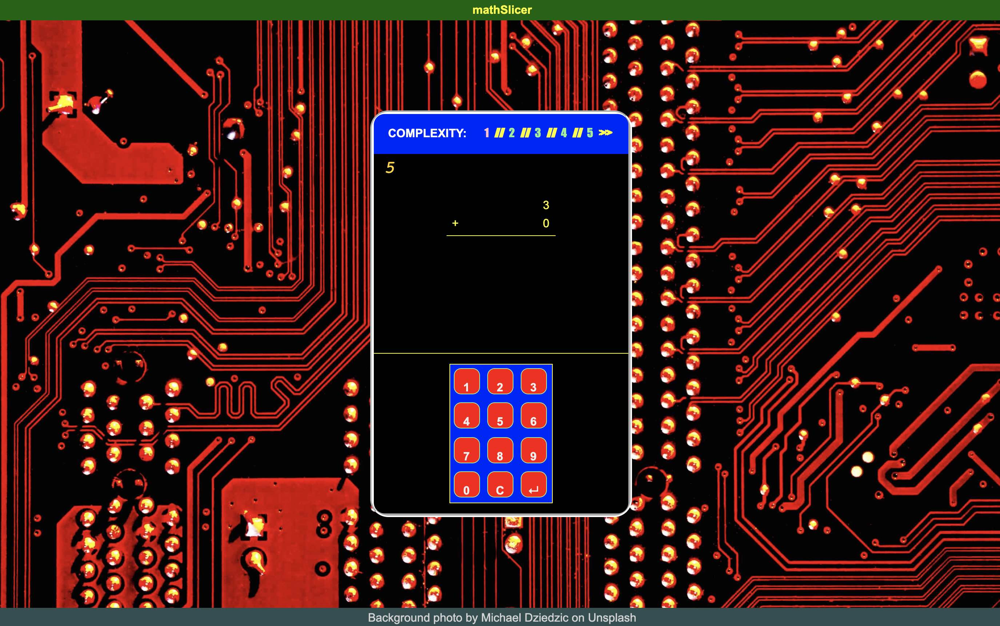
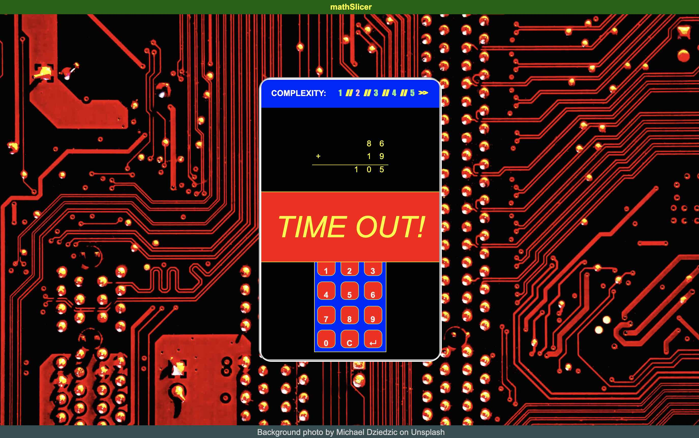
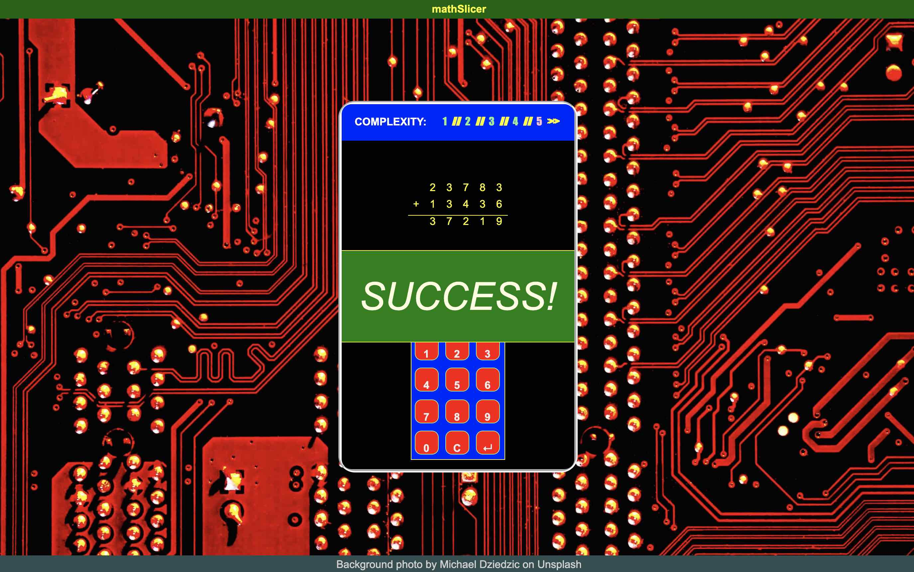

# mathSlicer - 
[](https://opensource.org/licenses/MIT)

> Slicing keycodes with the power of math

I was making a bounty hunter / bug killing space game to play with my seven-year-old son, but I wanted to incorporate a math-based minigame to reward him for practicing math problems with in-game loot.
The web app needed to be lightweight and self-contained. It had to be designed with mobile first in mind so I wouldn't have to pull out the computer during the board game. I wanted it to be controlled by number of digits so I could manage how difficult the problem would be. Finally, I wanted to incorporate a timer to generate pressure to solve the problem.


## User Story

```
AS A PARENT 
I WANT A MATH MINIGAME
SO THAT MY CHILD CAN PRACTICE MULTI-COLUMN ADDITION AND SUBTRACTION
```

```
GIVEN THAT I NEED A RANDOM MATH PROBLEM
WHEN I INDICATE THE NUMBER OF DIGITS
THEN THE APP GENERATES A NEW ADDITION OR SUBTRACTION PROBLEM

WHEN I INTERACT WITH THE INTERFACE
THEN MY INPUT IS DISPLAYED DYNAMICALLY ON THE SCREEN

WHEN I ENTER AN ANSWER
THEN THE APP CHECKS IT AGAINST THE CORRECT SOLUTION AND INDICATES SUCCESS OR FAILURE

WHEN I TAKE TOO LONG TO ANSWER
THEN THE APP TIMES OUT

WHEN I USE THE APP ON A MOBILE DEVICE
THEN THE APP MAINTAINS ITS PRESENTATION AND UTILITY
```
            


## Graphic


## Table of Contents
* [Technologies](#Technologies)
* [Getting Started](#Getting)
* [Usage](#Usage)
* [Project Status](#Project)
* [Frequently Asked Questions](#FAQ)
* [Questions](#Additional)
* [Contributing](#Contributing)
* [License](#License)
## Technologies
HTML\
CSS\
vanillaJS\
setInterval()

## Getting Started
The page has an assets folder with the CSS and JS files, in addition to the image for the background. As long as these are in place, all you have to do is launch the HTML page in your web browser.


## Usage
Clicking the Complexity Numbers at the top of the interface changes the level, resets the current problem, and restarts the timer. Clicking or, on a touchscreen device, tapping the keys in the bottom half of the interface enters digits in the answer field, which updates dynamically. The 'C' key clears the field, while the Enter key finalizes the answer. If you prefer, you can also use the keyboard to enter your answer: the number keys, 'C', and 'E' or Enter keys.
If you enter an incorrect answer, a Failure notification flashes on the viewscreen. If you let the timer run out before you enter an answer, a Timeout notification flashes on the viewport. If you enter the correct solution before the timer runs out, a Success notification appears.






## Project Status
Finished


## Additional Questions
Message me.

## Contributing
Contact us for guidelines on submitting contributions.

## License
This project is licensed under the The MIT License.


### ionathas78

This file generated on 1/4/2021 by goodReadMeGenerator, copyright 2020 Jonathan Andrews

